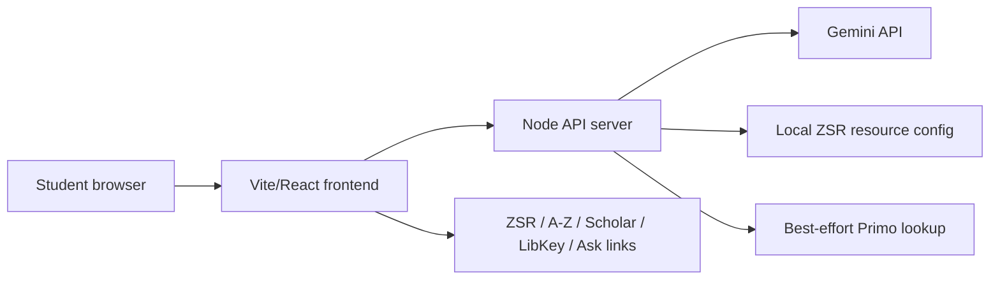

# Architecture Summary

## Runtime pieces

## Frontend

- `src/App.jsx`: app shell, sessions, mode selector, topic/follow-up composer, API calls.
- `src/AssistantMessage.jsx`: response rendering, search plan, source cards, citation/full-text helpers, next-step buttons.
- `src/styles.css`: visual design and responsive layout.

## Backend

- `server/native.js`: canonical demo/deploy server; serves the built React app plus API routes.
- `server/index.js`: older Express route implementation kept for reference while the native server is the deploy target.
- `server/gemini.js`: Gemini prompt and JSON response schema.
- `server/retrieve.js`: local resource matching and search-tool metadata.
- `server/primo.js`: best-effort public Primo discovery lookup.
- `server/log.js`: local query/feedback JSONL logging; can disable query logging with `LOG_QUERIES=off`.

## Editable ZSR guidance

- `config/researchAgent.js`: research-intent router, database/resource config, citation guide placeholders, fallback search logic.
- `config/libraryLinks.js`: common ZSR/Scholar/LibKey links and mode definitions.
- `server/resources.json`: curated resources used by retrieval.

## Environment variables

- `GEMINI_API_KEY`: required for live AI responses.
- `GEMINI_MODEL`: optional Gemini model override.
- `LOG_QUERIES`: set `off` to disable local query logging.
- `PRIMO_LIVE`: set `off` to disable best-effort public Primo lookup.
- `VITE_WFU_LIBKEY_LIBRARY_ID`: optional future LibKey/Third Iron ID if provided by ZSR.
- `PRIMO_API_ENDPOINT` / `PRIMO_API_KEY`: future official Primo API integration placeholders.

## Current integration stance

This is not an MCP server and does not need to become one yet. The current useful behavior is local-config-based routing plus link-outs. A deeper integration should wait until ZSR can confirm official access paths and data governance.
