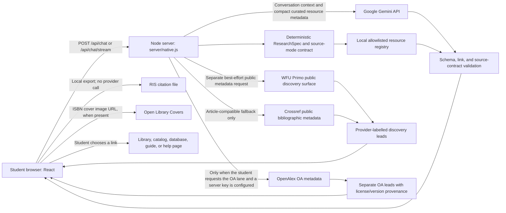

# Technical Architecture and Data Flow

This is an implementation description of the current prototype. “Future” items are not present, approved, or promised. The canonical deployed server entry point is `server/native.js`; `server/index.js` is a non-canonical Express implementation retained for parity and tests.

## Current request and discovery paths

These are separate operations. Gemini does not perform the Primo, Crossref, or OpenAlex request, and no public-metadata provider supplies the generated research orientation.

## Deterministic planning

The local planner in `config/researchAgent.js` normalizes the request into a ResearchSpec, applies the selected source-mode contract, ranks eligible resources, compiles database-specific queries, and validates the resulting plan. The current plan reports its configuration version and deterministic plan hash so an evaluated result can be tied to the exact rules used.

The governed inputs are:

- `config/researchSpec.js`: bounded ResearchSpec parsing, normalization, student corrections, premise checks, and deterministic hashing.
- `config/resourceCapabilities.js`: authoritative source-mode contracts, resource capabilities, query dialects, and configuration version.
- `config/queryCompiler.js`: database-specific query compilation and concept-preservation validation.
- `config/researchAgent.js`: librarian-editable resource records, topical profiles, deterministic routing, and safe-failure behavior.
- `config/libraryLinks.js`: search-mode descriptions and common ZSR, citation, access, and help links.
- `config/subjectFocus.js`: student-selected and auto-detected disciplinary lenses.
- `config/institutionProfile.js`: deployment-neutral institution fields and privacy defaults used by validation, configuration diff, and release evidence. The current WFU runtime still reads its operational links and environment variables from the existing modules; there is no runtime institution switch. The Duke entry is an unapproved blank template and cannot activate a Duke deployment.
- `config/librarianDirectory.js`: institution-owned person/service records, review windows, public-source or approval status, and generic fallback. Deterministic routing may show a name only when the record validates and is active.
- `config/accessScope.js`: the governed library, open-access, and combined source-lane choices.
- `config/researchIntegrationPolicy.js`: explicit non-activation status for full-text summaries, Scite MCP, and repository licensing.
- `server/resources.json`: compact retrieval metadata used to construct model context.

Clickable starting points from Gemini are checked against the curated allowlist in `server/validate.js`. The server-owned source contract can replace generated routing fields with deterministic paths and searches. A model response cannot create an arbitrary clickable database or library URL in the governed plan.

## What Gemini receives and does

The server sends Gemini conversation turns, response-style and source-mode instructions, the selected subject focus, and compact metadata for locally routed resources. Gemini returns structured JSON for a short research orientation and supporting guidance.

Gemini does not browse library pages, search Primo or OpenAlex, query licensed databases, retrieve or summarize source full text, verify holdings, determine user entitlement, or authenticate a student. Its generated orientation is not a literature review, research conclusion, or claim of exhaustive coverage.

## Public metadata discovery

`server/primo.js` makes a best-effort server-side request to WFU’s public Primo discovery surface. The current deployment does not use an institution-issued Primo API key. `PRIMO_LIVE=off` disables public discovery while leaving the deterministic plan available.

In books mode, the public Primo request asks for delivery metadata. When the response supplies a best location, call number, and availability status, the server returns those exact fields with a check timestamp and a direct record link. The interface describes this as status “when checked,” warns that it can change, and provides ZSR Delivers as the request fallback. Missing delivery fields stay missing.

For article-compatible modes, Crossref may be queried when Primo returns too few usable records. Crossref records are bibliographic leads, not confirmation of ZSR ownership, full-text access, or topical relevance. They are labelled by provider and should be searched through ZSR before use. Books and primary-source modes do not use Crossref as their fallback.

`server/openalex.js` is an isolated, optional OpenAlex provider. It runs only when the student selects an access scope containing the open-access lane and `OPENALEX_API_KEY` is configured server-side. The provider enforces provider-reported OA status, excludes retractions and weak matches, returns only safe HTTPS locations, and records the exact location license, version, and host when supplied. It never downloads or summarizes full text. OpenAlex metadata is CC0; linked works retain their own rights. The library and OA lanes are not conflated.

RIS files are constructed in the browser from metadata already returned in a source lead. Export performs no lookup and does not fill absent citation fields.

For a record with an ISBN and no provider thumbnail, the server may return an Open Library Covers image URL. The browser then requests that image from `covers.openlibrary.org`; Open Library is not asked for the student’s full chat history. Cover availability is cosmetic and does not affect routing.

## Identity, browser storage, and server records

- There is no Wake Forest, Duke, or Vanderbilt login, SSO, student account, or institutional authorization layer. Restricted librarian QA uses a deployment-level `ADMIN_TOKEN`, not institutional identity or role management.
- Chat sessions, folders, assignment briefs, saved items, search history, and draft input are stored in browser `localStorage`. They are not synced to an institution and are not encrypted by this application.
- Gemini requests leave the application server and are governed by the configured Google API account and terms.
- Query logging defaults off. `LOG_QUERIES=on` enables aggregate query events; raw query text requires the separate `LOG_QUERY_TEXT=on` switch.
- Feedback and handoff logs default to metadata-only records. Text/detail retention requires separate opt-in flags.
- Handoff contact retention uses the actual flag `HANDOFF_STORE_CONTACT=on` and only has effect when handoff-detail storage is also enabled.
- Retention and record caps are controlled by `LOG_RETENTION_DAYS` and `LOG_MAX_RECORDS`.
- Feedback, handoff, and query-summary reads require a timing-safe `ADMIN_TOKEN` bearer check and return a not-found response when unauthorized. The public pilot-status route contains configuration/status aggregates, not retained record contents.

See `docs/data-inventory.md` for field-level handling and `docs/privacy-logging-note.md` for operator guidance.

## HTTP and provider reliability boundary

Both server entry points use shared request parsing, bounded JSON bodies, per-scope rate limits, security headers, and same-origin or explicit-origin CORS rules from `server/httpSecurity.js`. Forwarded client addresses are trusted only when a bounded `TRUST_PROXY` value is configured. Administrative reads require `ADMIN_TOKEN` and use timing-safe comparison.

Gemini calls have an abortable timeout, bounded retry for transient failures, and a circuit breaker. Public Primo, Crossref, and OpenAlex requests fail closed to an empty result set. OpenAlex also has a bounded timeout and short-lived process-local metadata cache. Model or discovery failure does not remove the deterministic plan. `/api/health` identifies the release process as alive, while `/api/ready` also checks required configuration and the current Gemini circuit state.

## Deployment and hostname stability

`render.yaml` describes a Node web service that builds the Vite frontend and starts `server/native.js`. It does not reserve, prove ownership of, or automatically preserve a particular Render hostname. Its configured service name (`zsr-research-navigator`) differs from the already circulated hostname:

`https://zsr-library-ai-research-navigator-1.onrender.com/`

To preserve that URL, deploy releases to the existing Render service rather than creating a new Blueprint service. Confirm the service identity in Render, test on a separate staging service, run smoke checks, and promote to the existing service. Do not infer URL continuity from `render.yaml` alone.

## Not present today

The prototype does not currently have an official Primo API integration, a live LibGuides/A-Z feed, an approved LibKey institutional identifier, institutional authentication, licensed-database APIs, a Scite MCP connection, OA full-text retrieval or summaries, a library ticketing integration, an approved Duke resource registry, or Duke credentials. It also has no selected repository software license. Placeholders, policy records, and templates for those capabilities are future integration points, not claims of current functionality.
